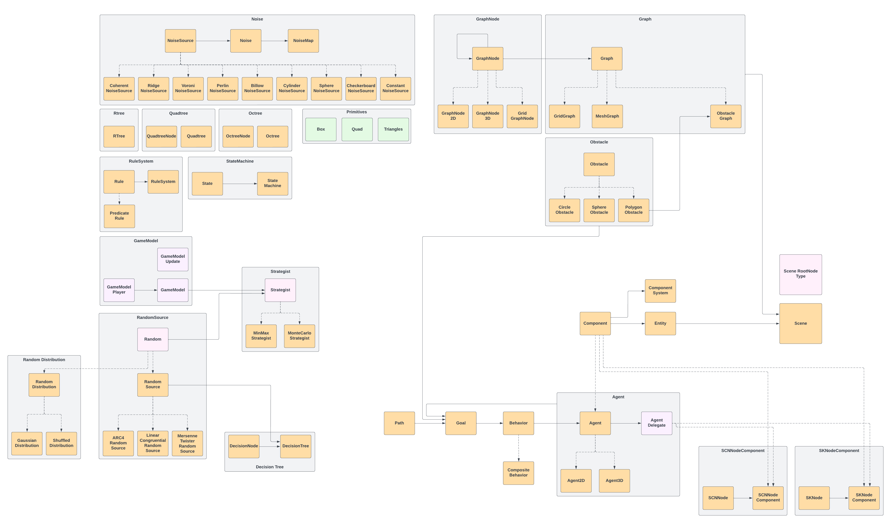

# GamePlayKit notes

[GamePlayKit documentation][GamePlayKit documentation]
[GamePlayKit Programming Guide][GamePlayKit Programming Guide]

---

### Entity and Components
- GKEntity
- GKComponent
- GKComponentSystem

### State Machine
- GKState
- GKStateMachine

### Spatial partitioning
- GKQuadtree
- GKQuadtreeNode
- GKOctree
- GKOctreeNode
- GKRTree

### Strategist
- GKStrategist
- GKMinmaxStrategist
- GKMonteCarloStrategist
- GKGameModel
- GKGameModelPlayer
- GKGameModelUpdate

### Decision Trees
- GKDecisionTree
- GKDecisionNode

### Path Finding
- GKGraph
- GKObstacleGraph
- GKMeshGraph
- GKGridGraph
- GKGraphNode
- GKGraphNode2D
- GKGraphNode3D
- GKGridGraphNode

### Agents, Goals, and Behaviors
- GKAgent
- GKAgent2D
- GKAgent3D
- GKGoal
- GKBehavior
- GKCompositeBehavior
- GKPath
- GKAgentDelegate

### Obstacles
- GKObstacle
- GKCircleObstacle
- GKSphereObstacle
- GKPolygonObstacle

### Procedural Noise
- GKNoiceSource
- GKNoise
- GKNoiseMap
- GKCoherentNoiseSource
- GKBillowNoiseSource
- GKPerlinNoiseSource
- GKRidgeNoiseSource
- GKVoroniNoiseSource
- GKCylindersNoiseSource
- GKSpheresNoiseSource
- GKCheckerboardNoiseSource
- GKConstantNoiseSource

### Randomization
- GKRandom
- GKRandomSource
- GKARC4RandomSource
- GKLinearCongruentialRandomSource
- GKMersenneTwisterRandomSource
- GKRandomDistribution
- GKGaussianDistribution
- GKShuffledDistribution

### Rule System
- GKRule
- GKNSPredicateRule
- GKRuleSystem

### Xcode and SpriteKit Integration
- GKScene
- GKSceneRootNodeType
- GKSKNodeComponent

### GamePlayKit Constants
- GKGameModelMaxScore
- GKGameModelMinScore

### GamePlayKit Structures
- GKBox
- GKMeshGraphTriangulationMode
- GKQuad
- GKTriangle

### GamePlayKit Enumrations
- GKRTreeSplitStrategy

---
[GamePlayKit documentation]: https://developer.apple.com/documentation/gameplaykit
[GamePlayKit Programming Guide]: https://developer.apple.com/library/archive/documentation/General/Conceptual/GameplayKit_Guide/index.html#//apple_ref/doc/uid/TP40015172

