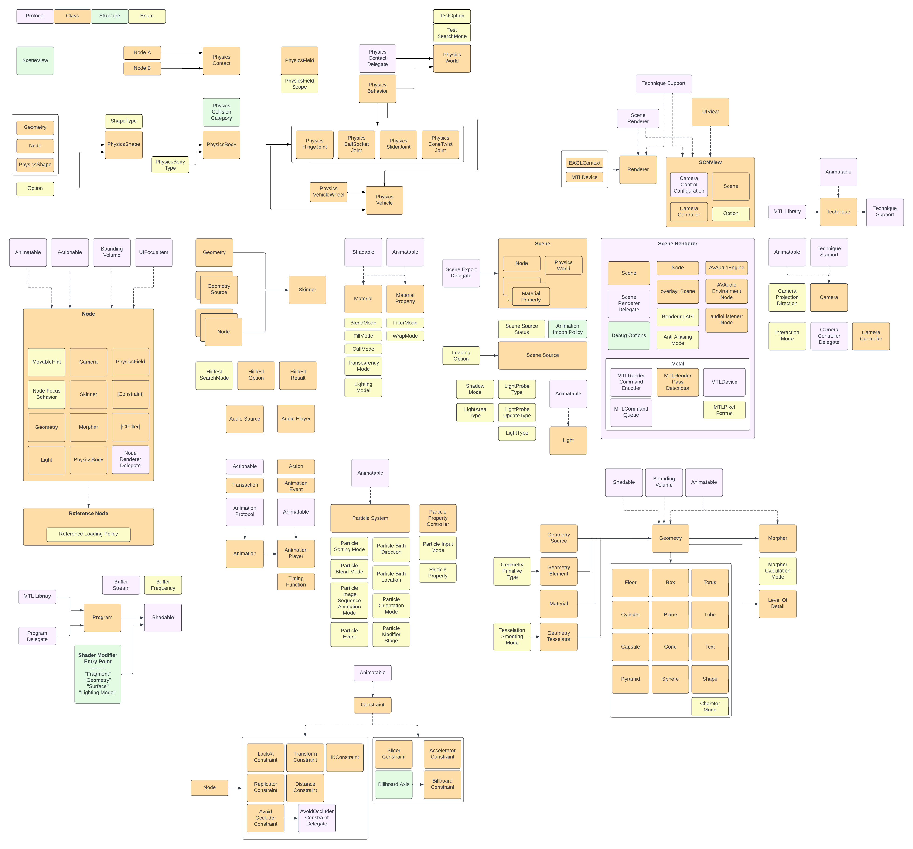

# GamePlayKit notes

[SceneKit documentation][SceneKit documentation]

---

### First Step
- SCNScene
- SCNView

### Scene Structure
- SCNNode
- SCNReferenceNode

### Display and Interactivity
- SCNSceneRenderer
- SCNSceneRendererDelegate
- SCNRenderer
- SCNHitTestResult

### Lighting and Camera
- SCNLight
- SCNCamera
- SCNMaterial
- SCNMaterialProperty

### Geometry
- SCNGeometry
- SCNGeometrySource
- SCNGeometryElement

#### Buit-in geometry type
- __Parametric Geometry__
  - SCNText
  - SCNShape
- __Basic Shape__
  - SCNFloor
  - SCNBox
  - SCNCapsule
  - SCNCone
  - SCNCylinder
  - SCNPlane
  - SCNPyramid
  - SCNSphere
  - SCNTorus
  - SCNTube

### Animation and Constraints
- __Animation__
  - __Actions__
    - SCNAction
    - SCNActionable

  - __Implicit Animation__
    - SCNTransaction

  - __Explicit Animation__
    - SCNAnimatable
    - SCNAnimationEvent
    - SCNAnimation
    - SCNAnimationPlayer
    - SCNTimingFunction
    - SCNAnimationProtocol

- __Constraints__
  - SCNConstraint

  - __Orientation Constraints__
    - SCNBillboardConstraint
    - SCNLookAtConstraint

  - __Position Constraint__
    - SCNDistanceConstraint
    - SCNAvoidOccluderConstraint

  - __Motion Constraints__
    - SCNAccelerationConstraint
    - SCNSliderConstraint

  - __Synchronization__
    - SCNReplicatorConstraint

  - __Inverse Kinematics__
    - SCNIKConstraint

  - __Customization__
    - SCNTransformConstraint 

- SCNSkinner
- SCNMorpher

### Physics
- __Physics Bodies__
  - SCNPhysicsBody
  - SCNPhysicsShape
- __Colision and Contact Detection__
  - SCNPhusicsContactDelegate
  - SCNPhysicsContact
- __Physics in a Scene__
  - SCNPhysicsWorld
  - SCNPhysicsField
  - SCNPhysicsBehavior
- __Joints__
  - SCNPhysicsHingeJoint
  - SCNPhysicsSliderJoint
  - SCNPhysicsBallSocketJoint
  - SCNPhysicsConeTwistJoint
- __Vehicle Simulation__
  - SCNPhysicsVehicle
  - SCNPhysicsVehicleWheel

### Particle Systems
- SCNParticleSystem
- SCNParticlePropertyController

### Audio
- SCNAudioSource
- SCNAudioPlayer

### Renderer Customization
- SCNShadable
- SCNProgram
- SCNBufferStream
- SCNTechnique
- SCNTechiqueSupport
- SCNNodeRendererDelegate

### Scene Asset Import
- SCNSceneSource

### Javascript
- SCNExportJavaScriptModule

### SceneKit Data Types
- __Vectors__
  - SCNVector3
  - SCNVector4
- __Transformation and Rotation__
  - SCNMatrix4
  - SCNQuaternion
- __Scalar__
  - SCNFloat
- __Others__
  - SCNActionTimingMode
  - SCNColorMask

### Structures
- SceneView

### Enumerations
- SCNLightAreaType
- SCNLightProbeType
- SCNLightProbeUpdateType

### SceneKit Constants
- SCN_ENABLE_OPENGL

### Others
- SCNBoundingVolume

---
[SceneKit documentation]: https://developer.apple.com/documentation/scenekit

