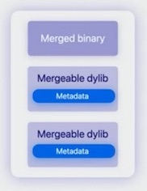
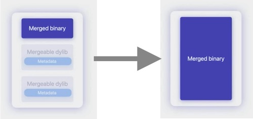
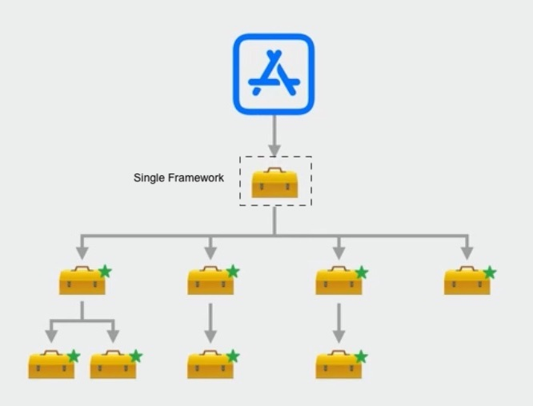

# Meet mergeable libraries

__Starting - Xcode 15__

[Meet mergeable libraries - WWDC23][Meet mergeable libraries - WWDC23]
- Meet mergeable libraries
- Using mergeable libraries
- Consideration for mergeable libraries

---
## Static and dynamic libraries overview

### Static libraries
Linking with apps

- object files archived together
- contents get copied into app binary
  - library is not needed after building
- only used for static linking
- build time increases as library changes
  - iterative building and debugging becomes slow

### Dynamic libraries
Linking with app

- also known as dylibs
- Binary inside frameworks
  - framework is not copied into app binary
- Path to library is saved in app binary
  - static linker records the installed path of the library into  the app binary for later.
- Must be embedded in the app bundle
  - any framework not in Apple SDK needs to be embedded into the app bundle.
- Miniumm static link time impact
  - when dynamic libraries are added/updated, the static linker does not need to copy the code. This results in faster builds.
  - adds runtime complexity. Dynamic linker (dyld) is needed to find and load framework dependencies.
    - steady increase in memory consumption at app launch time as dependency tree grows.
    - System libraries are heavily optimized to account for this but it does not apply to embedded frameworks.

| | Static Library | Dynamic Library|
| --- | --- | --- |
| Runtime | optimal runtime | x |
| Build Time | x | optimal build time |
| Launch Time | minimal impact | noticeable impact |


Mergeable libraries combine best of both Static and Dynamic linking strategy.
---
## Meet mergeable libraries

### Library Merging
Consider a binary linked to Depdendencies
```
[Binary]
[Dependency dylib]
[Dependency dylib]
```

Dependencies linked to a binary can become mergeable libraries
```
[Binary]
[Mergeable dylib]
[Mergeable dylib]
```

Linked output can become Merged binary
```
[Merged binary]
[Mergeable dylib]
[Mergeable dylib]
```

### Merged Library
- Built as dynamic libraries
  - any dynamic library can be built as mergeable
- Metadata is emitted into the library
  - when static linker creates library, it also generates metadata
  - the metadata is in the binary increasing the overall size
  - It allows the linker to treat the library similarly to a static library when it's used as a link dependency


- Can be linked as a dynamic library or merged
  - With the metadata, users of the library can choose to statically link as normal dynamic libraries or merge them

### Merged Binary
- Can be an executable or dynamic library
- Merging is similar to static library linking
  - In the end, you're left with a binary that contains the segments of the libraries.



- Output Binary type remains the same

### Library merging
- Starting Xcode 15
- Enabled by new static linker
- Libraries to merge are built with `-make_mergeable`
  - this tells the linker to record metadata
- Binary merges all input with `-merge_library` or `-merge_framework`
  - Linker uses the metadata along with merged libraries to produce final output with the options `-merge_library` or `-merge_framework`
- Xcode handles build steps
  - managed by Xcode
  - you can see the options being applied when inspecting your build logs.


__How is merging better than linking?__

_Size consideration_
- Mergeable libraries only needed at build time
  - Libraries and their metadata aren't needed after merge and can be removed.
- Liker deduplicates across all mergeable libraries
  - When merging, linker can de-duplicate content such as strings, across all libraries.
  - e.g. it removes redundant symbol references , Objective-C selectors and objc_msgsend stubs.
  - This results in smaller overall app bundle.
- Can apply linker options and optimizations
  - Image Type of final binary remains same. Therefore already supported linker optimizations can be applied.

_App Launch consideration_
- Fewer fraemworks result in faster launch and less memory consumptions
- Reduce frameworks to load with simple options

A single framework can be created that merges all the mergeable library.
- All embedded frameworks can become mergeable.
- Dyld only needs to load that one library containing all segments across the embedded frameworks.
- Simplify large dependency chains by merging dependencies.



__How to enable library merging?__
  
1. Automatic merging
2. Manual merging


---
## Benefits of mergeable libraries
---
## Automatic merging in Xcode
---
## Manual merging in Xcode
---
## Debug mode
---
## Considerations
---
## Recommendations
---
## Wrap-up
---

## Reference

- [Meet mergeable libraries - WWDC23][Meet mergeable libraries]

[Meet mergeable libraries]: https://developer.apple.com/videos/play/wwdc2023/10268/
