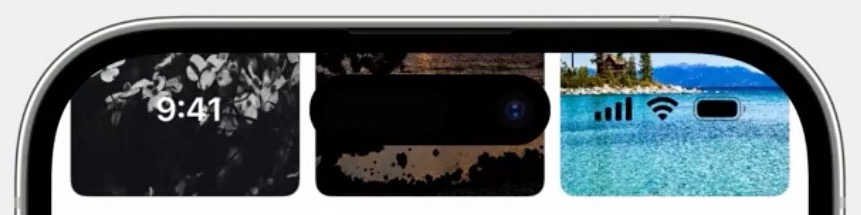
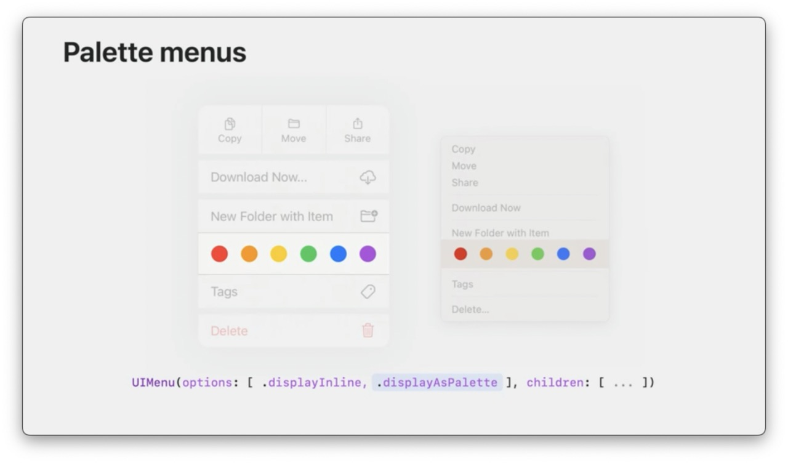

# Whats new in UIKit
## WWDC 2023
[What's new in UIKit - WWDC23][What's new in UIKit]

(iOS 17)

---
- [Key Features](#key-features)
    - [Xcode previews](#xcode-previews)
    - [View controller lifecycle](#viewcontroller-lifecycle)
    - [Trait system enhancements](#trait-system-enhancements)
    - [Animation symbol images](#animated-symbol-images)
    - [Empty states](#empty-states)
- [Internationalization](#internationalization)
    - [Dynamic line-height adjustment](#dynamic-line-height-adjustment)
    - [Wrapping and hyphenation](#wrapping-and-hyphenation)
    - [Locale based UIImage](#locale-based-uiimage)
- [Improvements for iPad](#ipad-improvements)
    - [Window dragging](#window-dragging-interaction)
    - [Sidebar and Stage Manager](#sidebar-and-stage-manager)
    - [Document support](#document-support)
    - [Apple Pencil](#apple-pencil)
    - [Keyboard scrolling](#keyboard-scrolling)
- [General Enhancements](#general-enhancements)
    - [Collection views](#collection-views-improvements)
    - [Spring animations](#spring-animations-parameters)
    - [Text interactions](#text-interactions)
    - [Status bar](#default-status-bar-style)
    - [Drag and drop](#drag-and-drop-enhancements)
    - [HDR images](#iso-hdr-images-support)
    - [Page control](#page-control)
    - [Palette menus](#palette-menus)
    - [tvOS menus](#tvos-menus)
---

## Key Features

### Xcode previews
available for UIKit

- Preview UIViewController
```swift
class LibraryViewController: UIViewController {
    // ...
}

#Preview("Library") {
    let controller = LibraryViewController()
    controller.displayCuratedContent = true
    return controller
}
```


- Preview UIView
```swift
class SlideshowView: UIView {
    // ...
}

#Preview("Memories") {
    let view = SlideshowView()
    view.title = "Memories"
    view.subtitle = "Highlights from the past year"
    view.images = ...
    return view
}
```


---

### ViewController Lifecycle

- new callback
```swift
UIViewController.viewIsAppearing(_:)
```
UIViewController lifecycle callback sequence:
- viewWillAppear(_:)
- viewIsAppearing(_:)
- viewDidAppear(_:)

Best place to update UI when view appears:
- View controller and view trait collections updated
- View added to hierarchy, has accurate geometry

Back-deploys to iOS-13.


- `viewIsAppearing` is called only once during appearance transition.
- Layout callbacks (`viewWillLayoutSubviews`, `viewDidLayoutSubviews`) can be called multiple times during transition
- any change made in `viewWillAppear`/`viewIsAppearing` becomes visible to user at the same time.
- any change made in `viewDidAppear` is visible to user after transition animation completes.

---

### Trait system enhancements

- Define custom traits to add your own data to UITraitCollection.
- Trait override APIs to easily modify trait values on any view or view controller.
- Flexible trait change registration: callbacks when traits change, instead of needing to override `traitCollectionDidChange` in a subclass.
- UIKit - Swift interoperability: bridge custom UIKit traits with custom SwiftUI environment keys to seamlessly pass data between UIKit and SwiftUI components.

For more, see: [Unleash the UIKit trait system - WWDC23][unleash the uikit trait system - wwdc23]

---

### Animated symbol images

SF symbol - iOS 17 - UIKit symbol effect API
- new universal animation for all symbols
- unified API across UI frameworks
- composite layer annotations for custom symbols


#### Examples

- adding simple effect
```swift
// Bounce the symbol once
imageView.addSymbolEffect(.bounce)
```

- adding indefinite effect
```swift
// to add a valiable color effect, which repeats
imageView.addSymbolEffect(.variableColor.iterative)

// to remove the effect later
imageView.removeSymbolEffect(ofType: .variableColor)
```

- adding transition effect
```swift
// change the image using replace effect
imageView.setSymbolImage(pauseImage, contentTransition: .replace.offUp)
```

For more, see: [Animate symbols in your app - WWDC23][animate symbols in your app - wwdc23]

---

### Empty states

When there is no content to display


- Empty Configuraton


- Loading Configuraton


- Empty Configuration with SwiftUI view


- Best place to update configuration:


---

## Internationalization
### Dynamic line-height adjustment


### Wrapping and hyphenation
- Improved line-breaking and hyphenation for Chinese, German, Japanese and Korean
- Optimized for text style and language
- Adopt text styles

For more, see: [What's new with text and text interactions - WWDC23][what's new with text and text interactions - wwdc23]


### Locale based UIImage


By default, UIKit uses device current language setting.

- Get Image based on system language setting
    ```swift
    // retrieve image based on current language setting
    imageView.image = UIImage(
        systemName: "character.textbox"
    )
    ```
- Get Image for a specific locale
    ```swift
    // retrieve image for a specific locale
    let locale = Locale(languageCode: .japanese)
    imageView.image = UIImage(
        systemName: "character.textbox",
        withConfiguration: UIImage.SymbolConfiguration(locale: locale)
    )
    ```
---

## Ipad Improvements

### Window dragging interaction
- Users can now pan on `UINavigationBar`
- Alternatively use `UIWindowSceneDragInteraction`
- Can setup gesture relationships
- Works with Mac Catalyst

### Sidebar and Stage Manager
For `column-style UISplitViewController` only (2-Column, 3-Column style):
- Tiled Sidebar
- Sidebar automatically hides when necessary.
    - Sidebar remains hidden until specifically requested to be shown
- Sidebar overlaid at narrow width.
    - When requested to be shown at narrow width, a Sidbar is displayed as an overlay.
    - Overlay Sidebar persists as window is resized.
- When dismissed and recalled at larger width, Sidebar comes back tiled.

Override with `preferredDisplayMode` and `preferredSplitBehavior`

### Document support
Improvements for document-centric apps
- New `UIDocumentViewController` base class
    - Standard appearance for document apps.
- `UIDocument` supports automatic renaming
    - UIDocument conforms to `UINaticationItemRenameDelegate`
    - set as rename delegate of the view controller's navigation item.

For more, see: [Build better document-based apps - WWDC23][build better document-based apps - wwdc23]


### Apple Pencil


Hover (iPad Pro and iOS 16.4)
- use `UIHoverGesturerecognizer`
- `zOffset` is normalized hover distance
- `adtitudeAngle` and `azimuthAngle`, to render accurate ink previews
- Supported by `UIPointerInteraction`

For more, see: [Build for the iPadOS pointer - WWDC20][build for the ipados pointer - wwdc20]

iOS 17 - PencilKit


#### Backward compatibility

- Check `requiredContentVersion` on model objects
    
    A new content version property on data model types like PKDrawing, PKStroke, and others indicates which PencilKit version is required to load the object.

    | Content version | Ink iOS version |
    | --- | --- |
    | 1 | iOS 14 |
    | 2 | iOS 17 |
- Provide a message or render fallback image
- Limit available inks with `maximumSupportedContentVersion`

### Keyboard scrolling

- `UIScrollView` can be scrolled using keyboard shortcuts
- PageUp, PageDown, Home and End
- Enabled by default on iOS 17
- can override behavior using `allowsKeyboardScrolling`

---
## General Enhancements

### Collection views improvements
- Collection view Performance


- Collection view layout enhancements
    - `NSCollectionLaoutDimension.uniformAcrossSiblings(estimate:)`
        - Works with self-sizing items to receive a consistent size based on the size of largest item.
        - Use only with small numbers of sibling items.
    
    
        Before
        
    
        After
        

### Spring animations parameters

- Duration, Bounce
    - The duration defines how long until you perceive the spring animation to settle, not how long the animation takes to fully complete, and it is independent of bounce. And increasing the bounce from zero adds bounce to the animation, without changing how long the animation feels.

- new UIView spring animation API
    ```swift
    UIView.animate(springDuration: 0.5, bounce: 0.0) {
        circle.center.x += 100
    }

    UIView.animate {
        circle.center.x += 100
    }
    ```
    For more, see: [Animate with Springs - WWDC23][animate with springs - wwdc23]

### Text interactions
#### Text Cursor improvements
- Accessories indicate input mode and dictation
- Redesigned text loupe and selection handles
- Custom implementation scan now use system-provided UI without `UITextInteraction`

#### Text item actions and menus
- New API for text item interaction
- Change the primary action or menu content
- Tag custom ranges of text for interaction

For more, see: [What's new with text and text interactions - WWDC23][what's new with text and text interactions - wwdc23]

### Default Status bar style
```swift
// default status bar style
override var preferredStatusBarStyle: UIStatusBarStyle {
    return .default
}
```

- in iOS 17, default style continuously adjusts to the content of the app (automatically changing status bar style between light and dark)
    
    
- it also allows status bar to split style when needed (e.g. left half is light and right half is dark)
    

### Drag and drop enhancements
- Launch apps by dropping supported content onto app icons
- specify `CFBundleDocumentTypes` in `Info.plist` to determine if dropped file is supported.
- Opened via `UIScene` delegate callbacks.

### ISO HDR images support

Supported by:
- `UIImageView`
- `UIGraphicsImageRenderer`
- `UIImageReader`

For more, see: [Support HDR images in your app - WWDC23][support hdr images in your app - wwdc23]

### Page control

- Represents fractional page progress
    - `UIPageControlProgress`
    - `UIPageControlTimerProgress`
    

- setting up a UIPageControlTimerProgress
    ```swift
    let timerProgress = UIPageControlTimerProgress(
        preferredDuration: 10
    )
    pageControl.progress = timerProgress

    timerProgress.resumeTimer()
    ```

- setting up a UIPageControlTimerProgress with custom timer
    ```swift
    let progress = UIPageControlProgress()
    pageControl.progress = progress

    myTimer.addPeriodicTimeObserver { timer in
        progress.currentProgress = Float(
            timer.seconds / timer.duration
        )
        // ...
    }
    ```

### Palette menus

(iOS 17, macOS Sonoma)




### tvOS menus


---

## Next step

- Compile your app for iOS 17
- Adopt new UIKit APIs
- Verify your app's layout for a variety of languages

---

## Reference

- [What's new in UIKit - WWDC23][What's new in UIKit]
- [Unleash the UIKit trait system - WWDC23][unleash the uikit trait system - wwdc23]
- [Animate symbols in your app - WWDC23][animate symbols in your app - wwdc23]
- [What's new with text and text interactions - WWDC23][what's new with text and text interactions - wwdc23]
- [Build better document-based apps - WWDC23][build better document-based apps - wwdc23]
- [Build for the iPadOS pointer - WWDC20][build for the ipados pointer - wwdc20]
- [Animate with Springs - WWDC23][animate with springs - wwdc23]
- [Support HDR images in your app - WWDC23][support hdr images in your app - wwdc23]

[What's new in UIKit]: https://developer.apple.com/videos/play/wwdc2023/10055/
[unleash the uikit trait system - wwdc23]: https://developer.apple.com/videos/play/wwdc2023/10057/
[animate symbols in your app - wwdc23]: https://developer.apple.com/videos/play/wwdc2023/10258/
[what's new with text and text interactions - wwdc23]: https://developer.apple.com/videos/play/wwdc2023/10058/
[build better document-based apps - wwdc23]: https://developer.apple.com/videos/play/wwdc2023/10056/
[build for the ipados pointer - wwdc20]: https://developer.apple.com/videos/play/wwdc2020/10093
[animate with springs - wwdc23]: https://developer.apple.com/videos/play/wwdc2023/10158
[support hdr images in your app - wwdc23]: https://developer.apple.com/videos/play/wwdc2023/10181