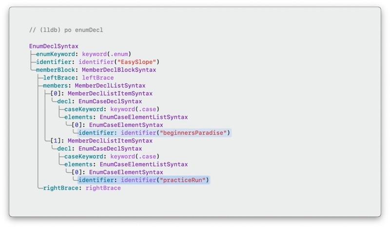
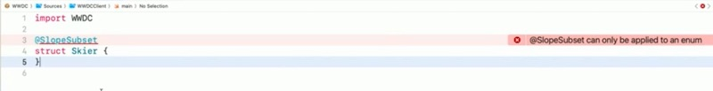

# Write Swift macros
## WWDC 2023
[Write Swift macros](https://developer.apple.com/videos/play/wwdc2023/10166/)

Swift macros generate code at compile time.

---
## Overview:

```swift
let calculations = [
    (1 + 1, "1 + 1"),
    (2 + 3, "2 + 3"),
    (7 - 3, "7 - 3"),
    (5 - 2, "5 - 2"),
    (3 * 2, "3 * 2"),
    (3 * 5, "3 * 5")
]
```

using macro
```swift
let calcuations = [
    #stringify(1 + 1),
    #stringify(2 + 3),
    #stringify(7 - 3),
    #stringify(5 - 2),
    #stringify(3 * 2),
    #stringify(3 * 5)
]
```

expanding macro
```swift
@freestanding(expression)
macro stringify(_ value: Int) -> (Int, String)
```

Macro implementation is defined in Compiler plugin.
While expanding macro, compiler sends macro definition to the compiler plugin.

Macro plugin parses the macro to Swift Syntax tree.
e.g.
#stringify(2 + 3)
is parsed to
[macro expansion](./images/macro_expansion.jpeg)


---

## Create a macro

Xcode: File > New > Package > choose `Swift Macro` template > Name your package (say WWDC)
The generated project has following structure

WWDC <Package>
|- Package.swift
|- Sources <Directory>
|   |- WWDC <Directory>
|   |- WWDC.swift                       // contains macro declaration
|   |- WWDCClient <Directory>
|   |- main.swift                       // contains macro usage
|   |- WWDCMacros <Directory>
|   |- StringifyMacro.swift             // contains macro definition

To see a macro expansion: Right Click on macro > `Expand Macro`
To see a macro definition: Right Click on macro > `Jupm to Definition`

```swift
// main.swift

import WWDC
let a = 10
let b = 20

let (result, code) = #stringify(a + b)
print("The value \(result) was produced by the code \"\(code)\".")
```

```swift
// WWDC.swift

@freestanding(expression)
public macro stringify<T>(_ value: T)  -> (T, String) = #externalMacro(module: "WWDCMacros", type: "StringifyMacro")
```

```swift
// StringifyMacro.swift

import SwiftCompilerPlugin
import SwiftSyntax
import SwiftSyntaxBuilder
import SwiftSyntaxMacros


public struct StringifyMacro: ExpressionMacro {
    public static func expansion(
        of node: some FreestandingMacroExpansionSyntax,
        in context: some MacroExpansionContext
    ) -> ExprSyntax {
        guard let argument = node.argumentList.first?.expression else {
            fatalError("compiler bug: the macro does not have any arguments")
        }
        return "(\(argument), \(literal: argument.description))"
    }
}

@main
struct WWDCPlugin: CompilerPlugin {
    let providingMacros: [Macro.Type] = [
        StringifyMacro.self
    ]
}
```

Macro template contains unit test for macro
```swift
// stringify test case

final class WWDCTests: XCTestCase {
    func testMacro() {
        assertMacroExpansion(
            """
            #stringify(a + b)
            """,
            expandedSource: """
            (a + b, "a + b")
            """,
            macros: testMacros
        )
    }
}

let testMacros: [String: Macro.Type] = [
    "stringify": StringifyMacro.self
]
```

__Swift macro template__

- Macro declaration defined the macro's signature
- Implementation operates on SwiftSyntax trees
- Easy to test.

---

## Macro roles

| macro| description |
|---|---|
| @freestanding(expression) | Creates a piece of code that returns a value |
| @freestanding(declaration) | Creates one or more declarations |
| @attached(member) | Adds new declarations inside the type.extension it's applied to|
| @attached(peer) | Adds new declarations alongside the declaration it's applied to|
| @attached(accessor) | Adds accessors to a property|
| @attached(memberAttribute) | Adds attributes to the declarations in the type/extension it's applied to|
| @attached(conformance) | Adds conformances to the type/extension it's applied to|


To know more, see [Expand on Swift macros][Expand on Swift macros]

Example: Creating a macro
```swift
enum Slope {
    case slope_easy_1
    case slope_easy_2
    case slope_medium_1
    case slope_medium_2
    case slope_hard_1
    case slope_hard_3
}

enum EasySlope {
    case slope1
    case slope2

    init?(_ slope: Slope) {
        switch slope {
            case .slope_easy_1: self = .slope1
            case .slope_easy_2: self = .slope2
            default: return nil   
        }
    }

    var slope: Slope {
        switch self {
            case .slope1: return .slope_easy_1
            case .slope2: return .slope_easy_2
        }
    }
}
```

__Creating a macro: Plan__
- Declare attached member macro
- Create empty macro implementation
- Create test case
- Write macro implementation
- Integrate macro into app

```swift
// WWDC.swift

@attached(member, names: named(init))
public macro SlopeSubset() = #externalMacro(module: "WWDCMacros", type:"SlopeSubSetMacro")
```

```swift
// SlopeSubSetMacro.swift

import SwiftCompilerPlugin
import SwiftSyntax
import SwiftSyntaxBuilder
import SwiftSyntaxMacros

public struct SlopeSubSetMacro: MemberMacro {
    public static func expansion(
        of attribute: AttributeSyntax,
        providingMembersOf declaration: some DeclGroupSyntax,
        in context: some MacroExpansionContext
    ) throws -> [DeclSyntax] {
        return []
    }
}

@main
struct WWDCPlugin: CompilerPlugin {
    let providingMacros: [Macro.Type] = [
        SlopeSubSetMacro.self
    ]
}
```

Write test case to test macro:
```swift
import SwiftSyntaxMacro
import SwiftSyntaxMacrosTestSupport
import XCTest
import WWDCMacros

let testMacros: [String: Macro.Type] = [
    "SlopeSubSet": SlopeSubSetMacro.self
]

final class WWDCTests: XCTestCase {
    func testSlopeSubset() {
        assertMacroExpansion(
            """
            @SlopeSubSet
            enum EasySlope {
                case slope1
                case slope2
            }
            """,
            expandedSource:,
            """
            enum EasySlope {
                case slope1
                case slope2
            }
            """
            macros: testMacros
        )
    }
}

```
Update test case to test macro expansion that generates initializer:
```swift
func testSlopeSubset() {
        assertMacroExpansion(
            """
            @SlopeSubSet
            enum EasySlope {
                case slope1
                case slope2
            }
            """,
            expandedSource:,
            """
            enum EasySlope {
                case slope1
                case slope2
                init?(_ slope: Slope) {
                    switch slope {
                        case .slope_easy_1: self = .slope1
                        case .slope_easy_2: self = .slope2
                        default: return nil
                    }
                }
            }
            """
            macros: testMacros
        )
    }
```
Update SlopeSubSetMacro so that test succeeds.

```swift
 public static func expansion(
        of attribute: AttributeSyntax,
        providingMembersOf declaration: some DeclGroupSyntax,
        in context: some MacroExpansionContext
    ) throws -> [DeclSyntax] {
        guard let enumDecl = declaration.as(EnumDeclSyntax.self) else {
            let error = ... // create an error
            throw error
        }
        ...
    }
```

To inspect EnumDeclSyntax, put a breakpoint and print `enumDecl` in debugger



```swift
 public static func expansion(
        of attribute: AttributeSyntax,
        providingMembersOf declaration: some DeclGroupSyntax,
        in context: some MacroExpansionContext
    ) throws -> [DeclSyntax] {
        guard let enumDecl = declaration.as(EnumDeclSyntax.self) else {
            let error = ... // create an error
            throw error
        }

        // retrieving enum elements
        let members = enumDecl.memberBlock.members
        let caseDecls = members.compactMap { $0.decl.as(EnumCaseDeclSyntax.self) }
        let elements = caseDecls.flatMap { $0.elements }
        
        ...
    }
```

Check the code that you need to generate:
``` swift
// initializer to generate

init?(_ slope: Slope) {
    switch slope {
        case .slope_easy_1:
            self. = .slope1
        case .slope_easy_2:
            self = .slope2
        default:
            return nil
    }
}
```


```swift
 public static func expansion(
        of attribute: AttributeSyntax,
        providingMembersOf declaration: some DeclGroupSyntax,
        in context: some MacroExpansionContext
    ) throws -> [DeclSyntax] {
        guard let enumDecl = declaration.as(EnumDeclSyntax.self) else {
            let error = ... // create an error
            throw error
        }

        // retrieving enum elements
        let members = enumDecl.memberBlock.members
        let caseDecls = members.compactMap { $0.decl.as(EnumCaseDeclSyntax.self) }
        let elements = caseDecls.flatMap { $0.elements }
        
        let initializer = try InitializerDeclSyntax("init?(_ slope: Slope)") {
            try SwitchExprSyntax("switch slope") {
                // using result builder

                for element in elements {
                    SwitchCaseSyntax(
                        """
                        case .\(element.identifier):
                            //TODO: check how to handle case where element identifiers don't match
                            // this wont work for enum cases where identifier does not match
                            self = .\(element.identifier)   
                        """
                    )
                }
                SwitchCaseSyntax("default: return nil")
            }
        }
        return [DeclSyntax(initializer)]
    }
```

To use Macro in an App.
- Open Project
- Add Macro package as local dependency
  - Project > Add Package Dependency > Add Local... 
  - Select Macro package > Add Package
    - select Macro Library > Add Package
- import Macro Library in File.
- use Macro

```swift
// Example: Using a macro

import WWDC

enum Slope {
    case slope_easy_1
    case slope_easy_2
    case slope_medium_1
    case slope_medium_2
    case slope_hard_1
    case slope_hard_3
}

@SlopeSubSet
enum EasySlope {
    case slope1
    case slope2

    // removed init code that will be generated by the macro

    var slope: Slope {
        switch self {
            case .slope1: return .slope_easy_1
            case .slope2: return .slope_easy_2
        }
    }
}
```

__Write macro__
- Start with Swift macro package template
- Use debugger to explore syntax node structure
- Develop macro based on test cases

---

## Diagnostics

Always emit error in your macros so that consumers are aware about it instead of debuggin the generated source code.

```swift
// write a test for failure
func testSlopeSubSetOnStruct() throws {
    assertMacroExpansion(
            """
            @SlopeSubSet
            struct Skier {
            }
            """,
            expandedSource:,
            """
            struct Skier {
            }
            """,
            diagnostics: [
                DiagnosticSpec(message: "@SlopeSubSet can only be applied to an enum", line: 1, column: 1)
            ],
            macros: testMacros
        )
}
```
update macro code to generate diagnostics
```swift
enum SlopeSubSetError: CustomStringConvertible, Error {
    case onlyApplicableToEnum
    var description: String {
        switch self {
            case .onlyApplicableToEnum: 
                return "@SlopeSubSet can only be applied to an enum"
        }
    }
}
 public static func expansion(
        of attribute: AttributeSyntax,
        providingMembersOf declaration: some DeclGroupSyntax,
        in context: some MacroExpansionContext
    ) throws -> [DeclSyntax] {
        guard let enumDecl = declaration.as(EnumDeclSyntax.self) else {
            throw SlopeSubSetError.onlyApplicationToEnum
        }

        // retrieving enum elements
        ...

        return [DeclSyntax(initializer)]
    }
```


To show error message at a different location than the attribute, generate warnings or fixes in Xcode, there's an `addDiagnostic` method on the context parameter.

---

__Generalizing Macro__

```swift
// WWDC.swift

@attached(member, names: named(init))
public macro EnumSubset<SuperSet>() = #externalMacro(module: "WWDCMacros", type:"EnumSubSetMacro")
```

```swift
// EnumSubSetMacro.swift

import SwiftCompilerPlugin
import SwiftSyntax
import SwiftSyntaxBuilder
import SwiftSyntaxMacros

enum EnumSubSetError: CustomStringConvertible, Error {
    case onlyApplicableToEnum
    var description: String {
        switch self {
            case .onlyApplicableToEnum: 
                return "@EnumSubSet can only be applied to an enum"
        }
    }
}
public struct EnumSubSetMacro: MemberMacro {
    public static func expansion(
        of attribute: AttributeSyntax,
        providingMembersOf declaration: some DeclGroupSyntax,
        in context: some MacroExpansionContext
    ) throws -> [DeclSyntax] {
         guard let enumDecl = declaration.as(EnumDeclSyntax.self) else {
            throw EnumSubSetError.onlyApplicationToEnum
        }

        guard let supersetType = attribute
            .attributeName.as(SimpleTypeIdenfierSyntax.self)?
            .genericArgumentClause?
            .arguments.first?
            .argumentType else {
                //TODO: handle error
                return []
            }

        // retrieving enum elements
        let members = enumDecl.memberBlock.members
        let caseDecls = members.compactMap { $0.decl.as(EnumCaseDeclSyntax.self) }
        let elements = caseDecls.flatMap { $0.elements }
        
        let initializer = try InitializerDeclSyntax("init?(_ slope: \(supersetType))") {
            try SwitchExprSyntax("switch slope") {
                // using result builder

                for element in elements {
                    SwitchCaseSyntax(
                        """
                        case .\(element.identifier):
                            //TODO: check how to handle case where element identifiers don't match
                            // this wont work for enum cases where identifier does not match
                            self = .\(element.identifier)   
                        """
                    )
                }
                SwitchCaseSyntax("default: return nil")
            }
        }
        return [DeclSyntax(initializer)]
    }
}

@main
struct WWDCPlugin: CompilerPlugin {
    let providingMacros: [Macro.Type] = [
        EnumSubSetMacro.self
    ]
}
```

Update tests to pass Slope as Generic parameter to `EnumSubSet` macro
```swift
import SwiftSyntaxMacro
import SwiftSyntaxMacrosTestSupport
import XCTest
import WWDCMacros

let testMacros: [String: Macro.Type] = [
    "SlopeSubSet": SlopeSubSetMacro.self
]

final class WWDCTests: XCTestCase {
    func testSlopeSubset() {
        assertMacroExpansion(
            """
            @EnumSubSet<Slope>
            enum EasySlope {
                case slope1
                case slope2
            }
            """,
            expandedSource:,
            """
            enum EasySlope {
                case slope1
                case slope2
                init?(_ slope: Slope) {
                    switch slope {
                        case .slope_easy_1: self = .slope1
                        case .slope_easy_2: self = .slope2
                        default: return nil
                    }
                }
            }
            """
            macros: testMacros
        )
    }

    func testSlopeSubSetOnStruct() throws {
    assertMacroExpansion(
            """
            @EnumSubSet<Slope>
            struct Skier {
            }
            """,
            expandedSource:,
            """
            struct Skier {
            }
            """,
            diagnostics: [
                DiagnosticSpec(message: "@EnumSubSet can only be applied to an enum", line: 1, column: 1)
            ],
            macros: testMacros
        )
}
}
```
__

## Summary
- Start with macro package template
- Write test cases
- Print syntax tree in debugger
- Write custom error message


---
[Expand on Swift macros]: https://developer.apple.com/videos/play/wwdc2023/10167